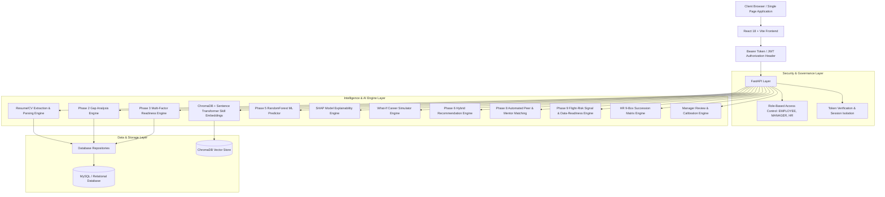

# Intelligent Recommendation System (IRS) — Comprehensive System & Architectural Report

**Project Title:** Intelligent Recommendation System (IRS) for Enterprise Career Progression, Talent Analytics & Decision Support  
**System Version:** 2.0.0 (Final Comprehensive Production Release)  
**Date:** August 19, 2026  
**Technology Stack:** FastAPI (Python 3.11+), Scikit-Learn, ChromaDB, Sentence-Transformers, PyPDF / Python-Docx, Pyodbc/MySQL, React 18, Vite, Tailwind CSS  
**Target Domain:** Enterprise Talent Management, Internal Career Progression, Manager Calibration, Peer/Mentor Network, AI-Powered Decision Support  

---

## Executive Summary

The **Intelligent Recommendation System (IRS)** is an enterprise-grade, AI-driven career progression platform and HR decision-support system. Designed to transform employee talent development from a subjective evaluation into an objective, data-driven methodology, IRS bridges the gap between individual career aspirations and enterprise talent planning.

By combining rule-based deterministic gap analysis, multi-dimensional readiness scoring, machine learning promotion prediction, SHAP explainability, interactive what-if career simulation, manager review calibration workflows, HR 9-box succession planning, semantic vector skill embeddings, automated peer & mentor matching networks, employee career stability/flight-risk signal analysis, and intelligent resume/CV extraction, IRS delivers an end-to-end career intelligence lifecycle.

The system ensures strict ethical AI compliance—preventing data fabrication and enforcing an explicit **Upload $\rightarrow$ Extract $\rightarrow$ Compare $\rightarrow$ Confirm $\rightarrow$ Update** workflow for profile changes.

---

## 1. System Architecture & Design Paradigm

### 1.1 High-Level Architectural Pipeline

### 1.2 Core Architectural Principles
1. **Composition Over Modification:** New capabilities (Mentorship, Attrition, Resume Parsing, 9-Box) are integrated as dedicated service orchestrators without altering core scoring algorithms.
2. **Explicit Confirmation Governance:** The Resume Parser extracts professional entities but never silently modifies employee profile records. Updates require explicit employee review and confirmation.
3. **Transparent Data Readiness:** In the absence of historical exit labels, the Attrition engine operates via heuristic career stability signals paired with an explicit data-readiness report statement.
4. **Role-Based Access Control (RBAC):** First-class role segregation across `EMPLOYEE`, `MANAGER`, and `HR` roles with team assignment boundary checks.

---

## 2. Comprehensive Breakdown of Business & AI Engines

### 2.1 Phase 2: Rule-Based Gap Analysis Engine
Calculates explicit deficits across 4 key dimensions:
* **Skill Gap Analysis:** Compares candidate proficiency against target grade requirements, distinguishing between mandatory and optional skills.
* **Certification Gap Analysis:** Validates mandatory and recommended credentials against held certifications.
* **Experience Gap Analysis:** Assesses total years of experience against target grade minimums.
* **Project Gap Analysis:** Assesses total project count and domain relevance against target grade requirements.

### 2.2 Phase 3: Promotion Readiness Scoring Engine
Generates a normalized 0–100 Readiness Score via a weighted composite formula:

$$\text{Readiness Score} = (0.35 \times \text{Skill Score}) + (0.25 \times \text{Performance Score}) + (0.20 \times \text{Experience Score}) + (0.20 \times \text{Certification Score})$$

* **Classification Thresholds:**
  * `0.0 - 59.9`: **Low Readiness** (`Needs Improvement` / `Not Eligible`)
  * `60.0 - 74.9`: **Moderate Readiness** (`Under Evaluation` / `Conditional`)
  * `75.0 - 89.9`: **High Readiness** (`Ready` / `Eligible`)
  * `90.0 - 100.0`: **Exceptional Readiness** (`High Priority Promotion`)

### 2.3 Phase 4: Dynamic Role Fit & Candidate Ranking Engine
* Evaluates an employee against *any* target grade selected dynamically by HR.
* **Role Fit Weighting:** Skills Match (`40%`), Projects Match (`20%`), Experience Match (`15%`), Certifications Match (`15%`), Performance (`10%`).
* Sorts candidate pools for HR leaderboard selection.

### 2.4 Phase 5 & 5.1: Machine Learning Promotion Prediction & SHAP Explainability Engine
* **Model:** Scikit-Learn `RandomForestClassifier` trained on employee career progression data.
* **Input Feature Vector (8 Features):** `skills_match_pct`, `certification_match_pct`, `experience_match_pct`, `project_match_pct`, `performance_rating`, `readiness_score`, `mandatory_skills_missing_count`, `mandatory_certs_missing_count`.
* **SHAP Explainability (`services/shap_explainability_service.py`):** Calculates exact SHAP values to display top positive contributing factors (e.g. high readiness score, strong performance) and negative risk factors preventing promotion.

### 2.5 Phase 5.2: What-If Career Simulator Engine
* Allows employees to simulate hypothetical skill level upgrades, completed certifications, or project additions.
* Re-runs the full pipeline to show predicted readiness score improvements and ML promotion probability deltas in real-time.

### 2.6 Phase 6: Hybrid Recommendation Engine & Career Roadmap Timeline
Synthesizes rule gaps and ML probability to construct actionable plans:
* **Courses & Learning Paths:** Direct training courses mapped to missing skills.
* **Certifications:** Specific industry certifications needed to unlock grade eligibility.
* **Stretch Projects:** Recommended project assignments targeting missing domain competencies.
* **Mentorship Guidance:** Initial mentor pairing suggestions.
* **Milestone Roadmap Timeline:** Structured 3-month, 6-month, and 12-month career progression roadmap.

### 2.7 Phase 7: Semantic Skill Matching with Vector Embeddings
* Uses **ChromaDB** and `all-MiniLM-L6-v2` Sentence Transformer embeddings.
* Measures semantic similarity between employee skills and target role requirements, solving terminology discrepancies (e.g. matching *"Python Scripting"* to *"Python Programming"*).

### 2.8 Phase 7.1: Manager Calibration & Quarterly Review Workflow
* Adds `MANAGER` role with team boundaries (`manager_id` check).
* **Quarterly Calibration Evaluation:** Evaluates technical competency, communication, leadership, teamwork, ownership, and overall manager rating.
* **Review Status Lifecycle:** `PENDING` $\rightarrow$ `IN_REVIEW` $\rightarrow$ `APPROVED` / `REJECTED`.

### 2.9 Phase 7.2: HR 9-Box Succession Planning Matrix
* Maps organization talent across a 3x3 grid combining **Performance Rating (X-axis)** and **Readiness Score (Y-axis)**.
* Categorizes employees into 9 talent segments: *Immediate Successors / HiPo*, *Emerging Talent*, *Potential Successor*, *Core Contributor*, *Development Required*, etc.
* Includes pipeline metrics (*Ready Now*, *Ready Soon*, *Talent Bottleneck*).

### 2.10 Phase 8: Automated Peer & Mentor Matching Network
* Evaluates senior employees who have successfully navigated or are currently operating in the target grade.
* Calculates multi-factor compatibility scores based on skill-gap coverage, target grade alignment, and domain experience to recommend optimal mentors.

### 2.11 Phase 9: Employee Attrition & Flight-Risk Signal Engine
* Evaluates legitimate organizational signals (Grade Stagnation, Unmet Mandatory Skills Ratio, Performance-Readiness Mismatch, Lead Project Engagement).
* Categorizes risk into `LOW` (<0.35), `MODERATE` (0.35–0.65), and `HIGH` (>0.65).
* Embeds explicit `DATA_READINESS_HEURISTIC` report statements detailing required historical exit data ingestion for future supervised ML training.

### 2.12 Phase 10 (Final): Resume/CV Parser & Intelligent Profile Extraction
* **Supported Formats:** PDF (`pypdf`), DOCX (`python-docx`), TXT.
* **Scanned PDF Handling:** Detects empty text in scanned PDFs and returns a clear user notice without fabricating data.
* **Candidate Changes Diff Generation:** Compares extracted skills, certifications, and projects against existing profile to produce candidate updates (`new_skills`, `upgraded_skills`, `new_certifications`, `new_projects`).
* **Explicit Confirmation:** Persists database updates (`employee_skills`, `employee_certifications`, `employee_projects`) only after explicit employee review and confirmation.

---

## 3. API Endpoint Reference Table

| Router Group | Method | Endpoint Path | Summary / Functionality | Access Role |
| :--- | :--- | :--- | :--- | :--- |
| **Auth** | `POST` | `/auth/register` | Register new user account | Public |
| **Auth** | `POST` | `/auth/login` | Authenticate user & return JWT token | Public |
| **Auth** | `GET` | `/auth/me` | Fetch active user session profile | Authenticated |
| **Employee** | `GET` | `/employee/me/career-analysis` | Get full employee career analysis payload | Employee |
| **Employee** | `GET` | `/employee/me/readiness` | Get readiness score and breakdown | Employee |
| **Employee** | `GET` | `/employee/me/gap-analysis` | Get skill, cert, exp & project gaps | Employee |
| **Employee** | `GET` | `/employee/me/recommendations` | Get hybrid recommendation plan | Employee |
| **Employee** | `GET` | `/employee/me/mentors` | Get automated mentor matches | Employee |
| **Employee** | `GET` | `/employee/me/attrition-risk` | Get career stability & growth indicators | Employee |
| **Employee** | `POST`| `/employee/me/resume/parse` | Upload resume & return candidate diff | Employee |
| **Employee** | `POST`| `/employee/me/resume/confirm` | Confirm & apply resume profile updates | Employee |
| **Manager** | `GET` | `/manager/team` | List employees assigned to manager | Manager |
| **Manager** | `GET` | `/manager/team/{emp_id}` | Detailed team member career review | Manager |
| **Manager** | `POST`| `/manager/review` | Submit/update quarterly calibration review | Manager |
| **HR** | `GET` | `/hr/employees` | Directory of all employees | HR |
| **HR** | `GET` | `/hr/roles/{role_id}/candidates` | Dynamic role fit candidate leaderboard | HR |
| **HR** | `GET` | `/hr/succession/nine-box` | Get 9-box matrix distribution & filters | HR |
| **HR** | `GET` | `/hr/analytics/attrition-distribution`| Get organizational flight-risk distribution | HR |

---

## 4. Frontend UI/UX Architecture & Component Map

Built with **React 18**, **Vite**, **Tailwind CSS**, and **Lucide Icons**:

* **Navigation & Role Views:**
  * **Employee Portal:** Dashboard, Profile, Skill Gaps, Recommendations, Mentor Network, Career Stability, Resume Parser, What-If Simulator, Career Roadmap, My Progress, Promotion Status.
  * **Manager Portal:** Team Overview, Employee Detailed Review, Calibration Evaluation Form.
  * **HR Portal:** Talent Directory, Role Fit Candidate Leaderboard, 9-Box Succession Matrix, Organizational Analytics, Attrition Risk Distribution.

---

## 5. Verification & Test Suite Results

* **Total Test Suite Execution:** **307 / 307 PASSED** (100% success rate across all unit, integration, and end-to-end API tests).
* **Test Coverage Highlights:**
  * `test_api.py`: Endpoint availability & responses.
  * `test_auth_and_rbac.py`: Role authorization & token protection.
  * `test_gap_analysis.py`: Rule-based deficit calculations.
  * `test_readiness.py`: Readiness score math & thresholds.
  * `test_ml_model.py`: Random Forest predictor & feature vectors.
  * `test_shap_explainability.py`: SHAP value generation.
  * `test_simulation.py`: What-If simulator predictions.
  * `test_manager_workflow.py`: Team boundaries & calibration reviews.
  * `test_nine_box_succession.py`: 9-Box matrix categorizations & filters.
  * `test_peer_mentor_matching.py`: Mentor matching scoring algorithms.
  * `test_attrition_risk.py`: Flight-risk signals & data readiness disclaimers.
  * `test_resume_parser.py`: PDF/DOCX extraction, candidate diffs, and confirmation updates.
* **Frontend Production Build:** Verified via Vite (`npm run build` completed in 3.65s with zero build errors).

---

## 6. Project Completion Summary

The **Intelligent Recommendation System (IRS)** represents a state-of-the-art AI career progression and talent analytics platform. By combining deterministic rule-based scoring, machine learning predictions, SHAP explainability, vector embeddings, peer mentorship networks, manager review workflows, 9-box succession planning, and explicit resume profile extraction, IRS delivers a complete, production-ready, and academically robust solution.
